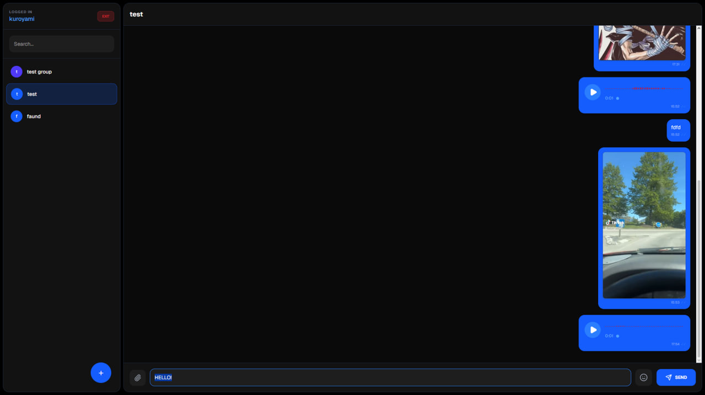
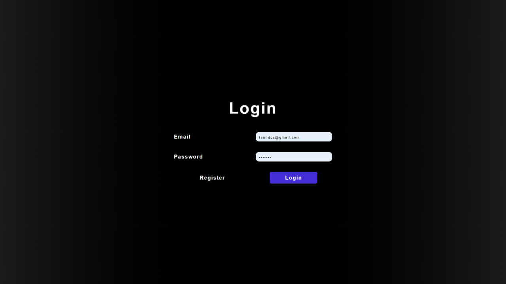
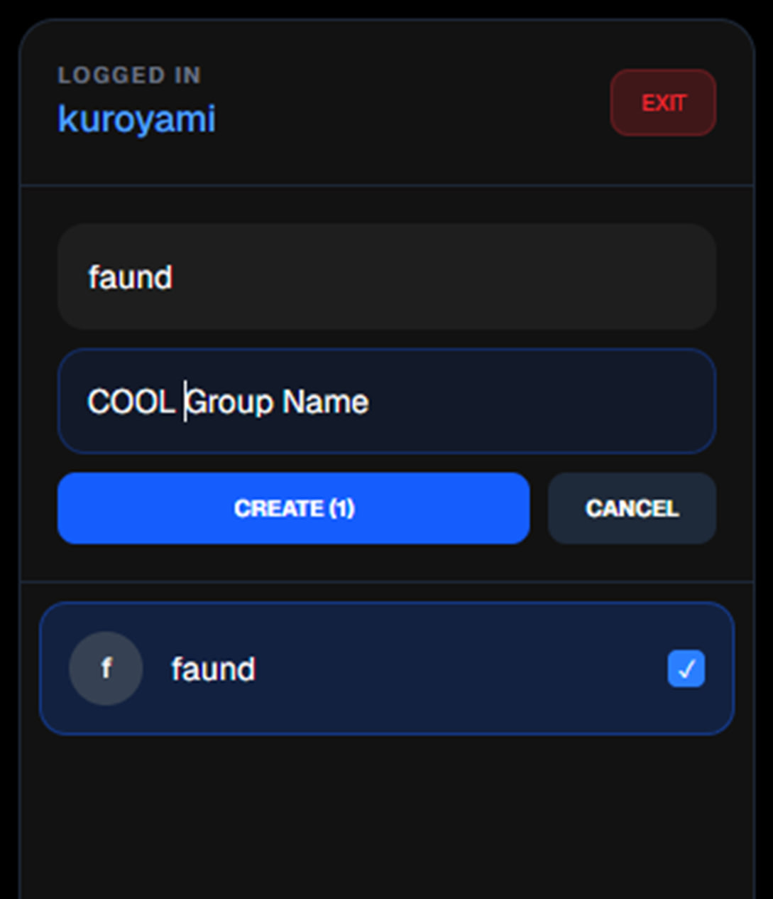

# 💬 Next.js Real-Time Web Messenger

A modern, responsive web messenger built with **React**, **Next.js**, and **Tailwind CSS**, using **MongoDB** for secure and efficient data storage. This project showcases full-stack web capabilities, focusing on seamless real-time messaging and a clean UI/UX layout.

---

## 📸 Interface Preview

> **Note for Clients:** Below are the actual screenshots of the web application interface, demonstrating the responsive layout, component spacing, and modern design implementation.

### 🖥️ Main Chat & Channels Interface

*Clean, modern dual-panel layout with active chats, channels list, and intuitive navigation interface.*

### 📱 Login Page

*Secure and user-friendly authentication screen, fully optimized and responsive for both desktop and mobile viewports.*

### ⚙️ Group Creating Menu

*Interactive modal interface designed with Tailwind CSS for seamless group creation and member management.*

---

## 🛠️ Tech Stack & Architecture

* **Front-End:** React, Next.js, HTML5, CSS3, Tailwind CSS (for modern UI & seamless responsiveness).
* **Back-End & Database:** Node.js, MongoDB (for structured data storage, chat logs, and user profiles).
* **UI/UX Focus:** Clean typography, intuitive navigation, fast loading speeds, and interactive components.

---

## 🚀 Key Features Implemented

* 👥 **1-on-1 & Group Chats:** Robust web messaging interface with real-time updates.
* 📢 **Channels:** Built-in community channels for broader communications.
* 📁 **Media Sharing:** Supported file, image, and GIF sharing within chat windows.
* 📱 **100% Responsive:** Adapts flawlessly to any desktop screen resolution.

---

## ⚡ How to Run Locally

1. **Clone the repository:**
```bash
   git clone [https://github.com/notkuroyami/web-messenger.git](https://github.com/notkuroyami/web-messenger.git)

Install dependencies:

Bash
   npm install
Run the development server:

Bash
   npm run dev
Developed by Serhii Chaika — Software Engineering Student & Full-Stack Developer.
